# Sync System Architecture Diagram

## System Components Diagram

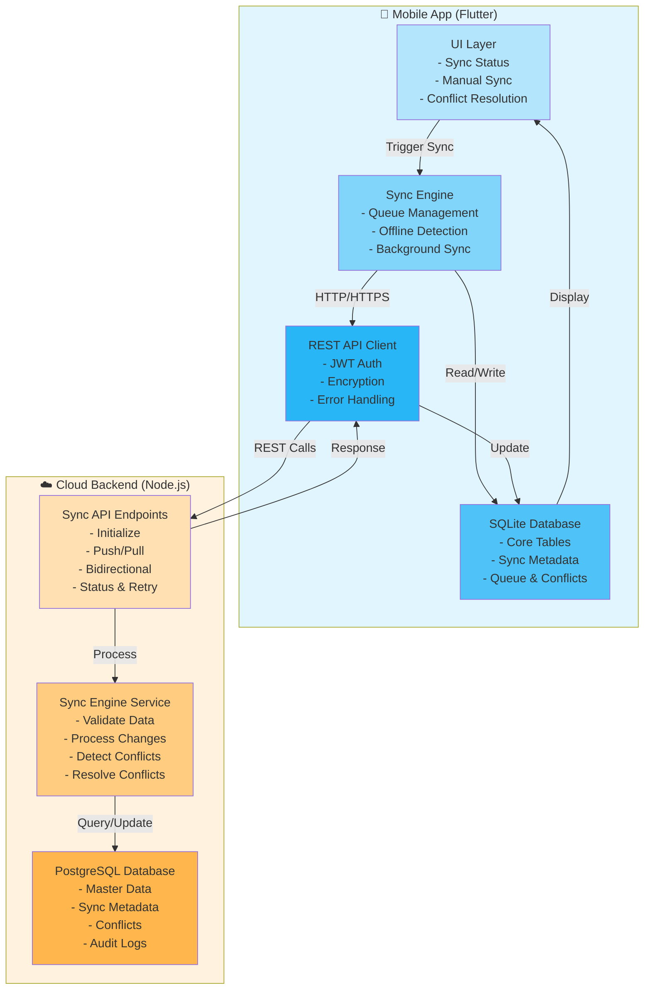

## Sync Flow Diagram

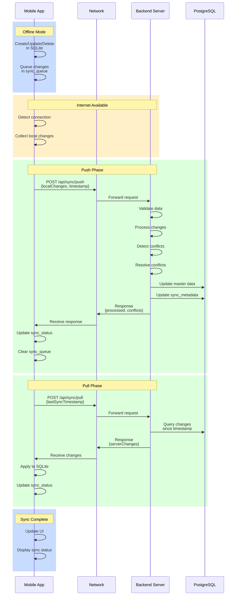

## Conflict Resolution Flow

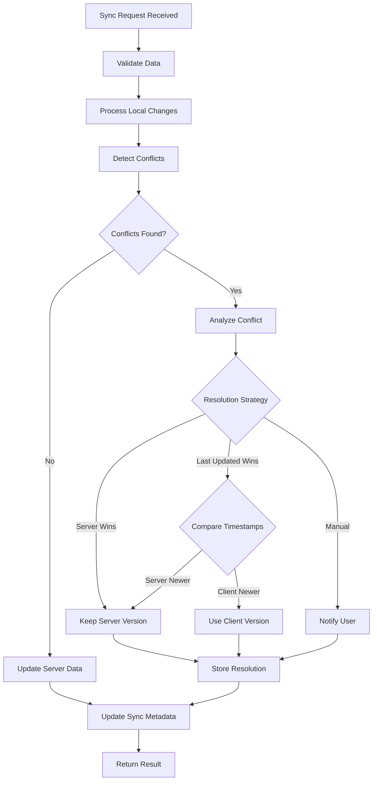

## Data Sync State Machine

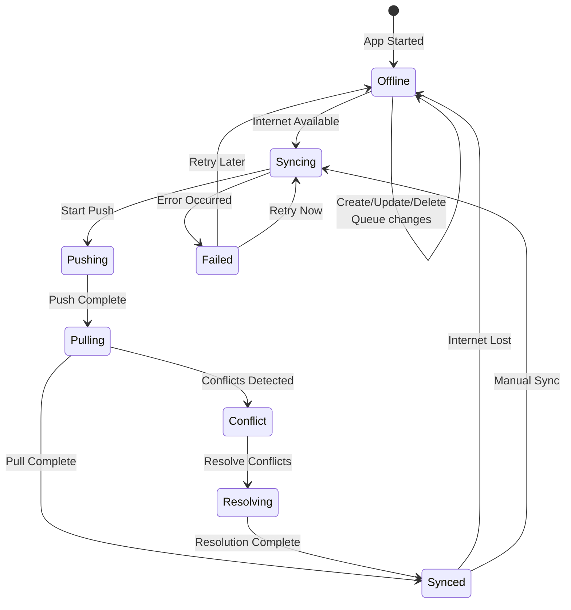

## Database Sync Metadata Structure

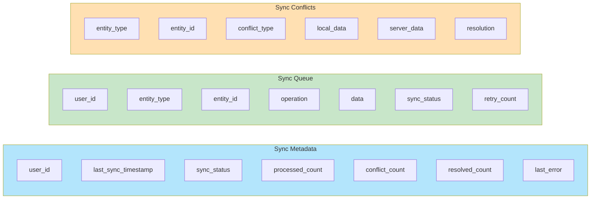

## Error Handling and Retry Flow

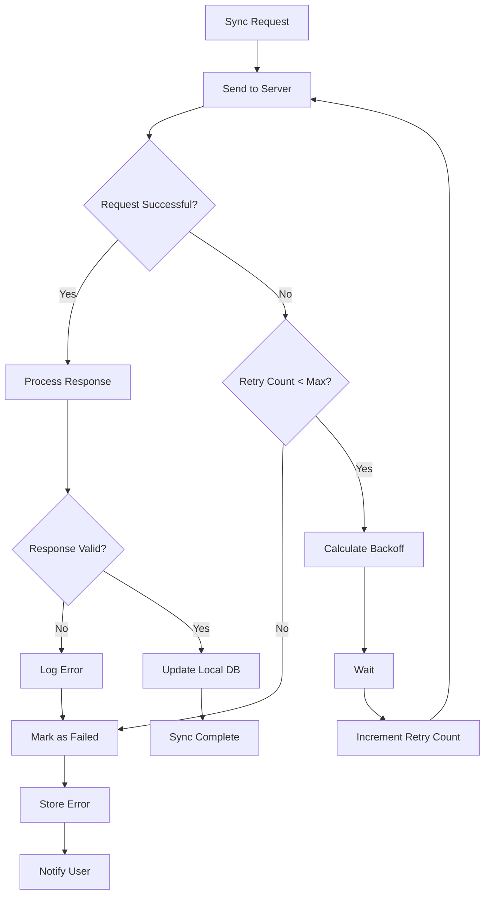

## Encryption and Security Flow

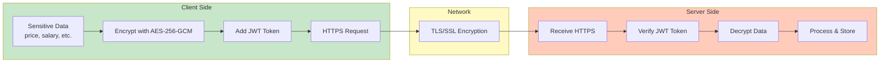

## Offline-First Architecture Layers

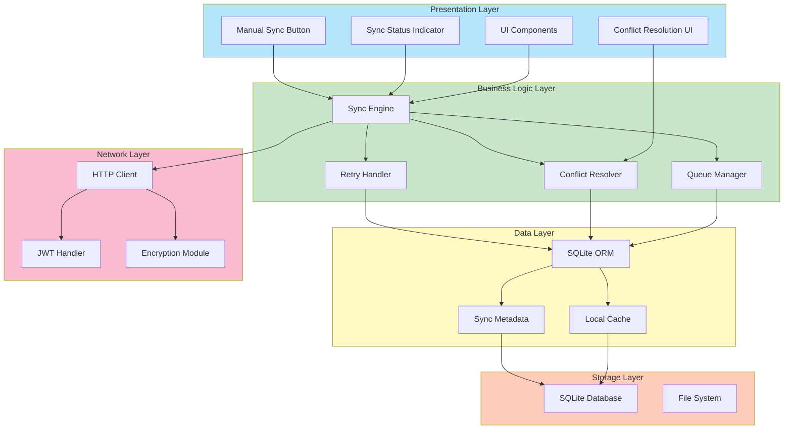

## Sync Timing and Triggers

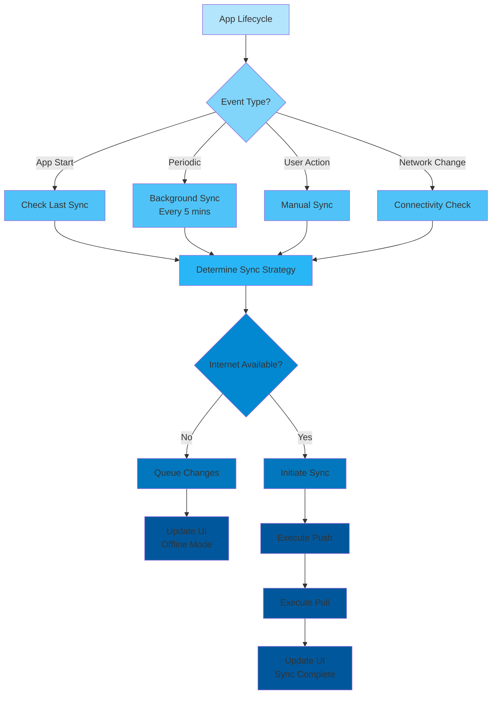

## Conflict Resolution Decision Tree

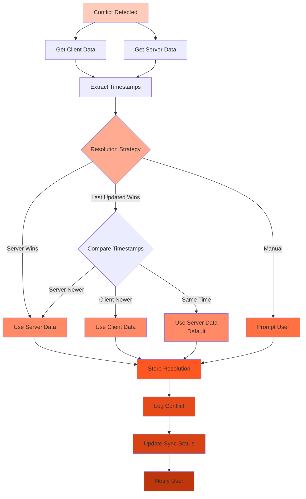

## Performance Optimization Strategies

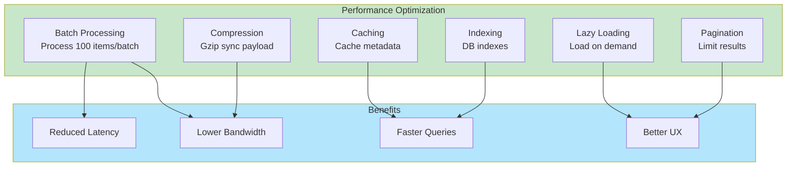

---

**Diagram Version:** 1.0.0
**Last Updated:** May 31, 2026
**Format:** Mermaid Diagrams
